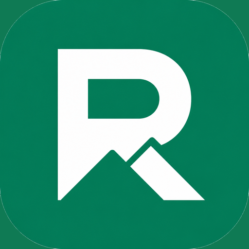

# RoRev

<p align="center">
  
</p>

Free open-source Chrome / Opera extension that shows **estimated** Roblox experience earnings and public stats on game pages.

> Heuristic estimates only — not official Roblox analytics. Not affiliated with Roblox Corporation or RoMonitor Stats.

## Install (unpacked)

1. Download or clone this repo
2. Chrome → `chrome://extensions` → enable **Developer mode**
3. **Load unpacked** → select this folder
4. Open any Roblox experience page (e.g. `https://www.roblox.com/games/...`)

Opera / Opera GX: `opera://extensions` → same steps.

## Features

- Compact far-right panel: estimated **total / monthly / daily** earnings (R$ + USD)
- **More** expands public stats (visits, favorites, likes, game passes, etc.)
- Local visit snapshots improve daily/monthly trends after revisits
- MIT licensed — no ads, no accounts

## How estimates work

Roblox does not expose public gamepass sales counts. RoRev estimates Robux-per-visit from public signals (visits, favorites, gamepass catalog), applies ~70% creator share, and converts USD with a default DevEx rate (`0.0035`).

## Privacy

Preferences and snapshots stay in `chrome.storage.local` on your device. See [store/privacy.html](store/privacy.html).

## Develop

No build step — edit files and click **Reload** on `chrome://extensions`.

```bash
node scripts/smoke.mjs   # optional API smoke test
```

## License

[MIT](LICENSE)
